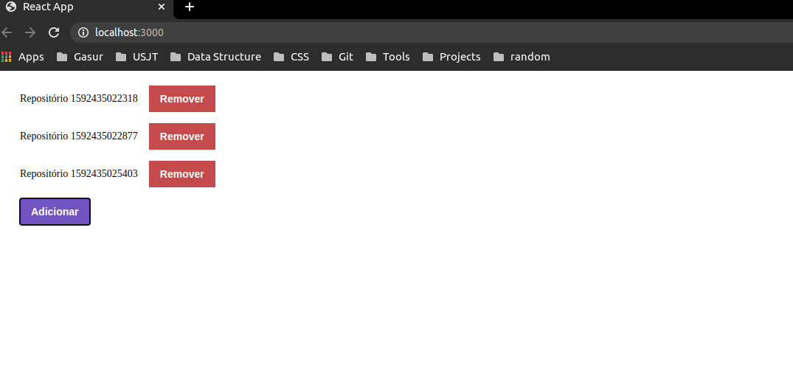

# Conceito-ReactJS
Desafio sobre os conceitos de ReactJS aplicados no Bootcamp GoStack

Em conjunto com o projeto: https://github.com/LucasnDomingues/Conceito-Nodejs.
Desenvolvi a parte visual para adição e exclusão de reposítórios.

## Foco do estudo
Componentização, propriedades, estado &  imutabilidade, utilização de API Rest para popular os dados da página.
